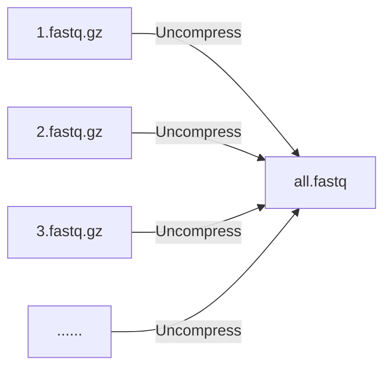
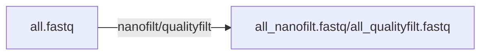

# NanoACT : a nanopore pipeline for amplicon clustering and taxonomy assignment

## Installation (Google Colab)

    !git clone https://github.com/Raingel/nanoACT.git 
    %cd nanoACT 
    !pip install --upgrade pip 
    !pip install -r requirements.txt

## Initialization

    from nanoact import nanoact
    dumb = nanoact.NanoAct()

## Usage
[combine_fastq()](#combine_fastq)

[nanofilt()](#nanofilt)

[qualityfilt()](#qualityfilt)

---
### combine_fastq
**解壓縮及合併所有fastq.gz檔案。**

 大部分basecalling軟體會產生許多fastq.gz檔案，本功能可以將所有fastq.gz檔案合併成一個fastq檔案。

 
	all_fastq = dumb.combine_fastq(
					src = "./bonito", 
					des = "./des/", 
					name = "all.fastq" 
				)
    
---
### nanofilt
### qualityfilt
**根據品質篩選序列**
把混在raw reads中的低品質的雜訊移除。
nanofilt的程式碼是來自 https://github.com/wdecoster/nanofilt
qualityfilt的是由本專案設計，其單純利用每序列的平均品質分數、長度進行篩選

 
	all_fastq = dumb.nanofilt(src = '/content/all.fastq',
                           des = '/content/drive/MyDrive/Data/2023-000006/1_nanoflit/',
                           name = 'all_nanofilt.fastq',
                           NANOFILT_QSCORE = 9,  #recommended 7-9 
                           NANOFILT_MIN_LEN = 400, #depends on the length of your reads 
                           NANOFILT_MAX_LEN = 7000 #depends on the length of your reads
                           )
			   
	fastq_nano = dumb.qualityfilt(src = '/content/all.fastq',
                           des = '/content/drive/MyDrive/Data/2023-000006/1_nanoflit/',
                           name = 'all_qualityfilt.fastq',
                           QSCORE = 9,  #recommended 7-9
                           MIN_LEN = 400, #depends on the length of your reads 
                           MAX_LEN = 7000 #depends on the length of your reads
			   )

