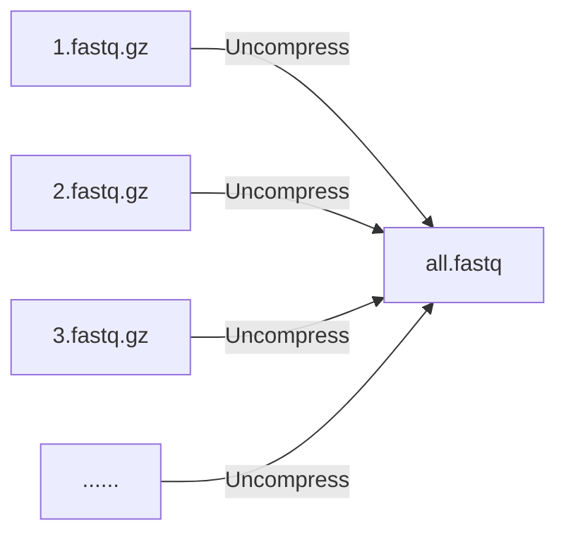
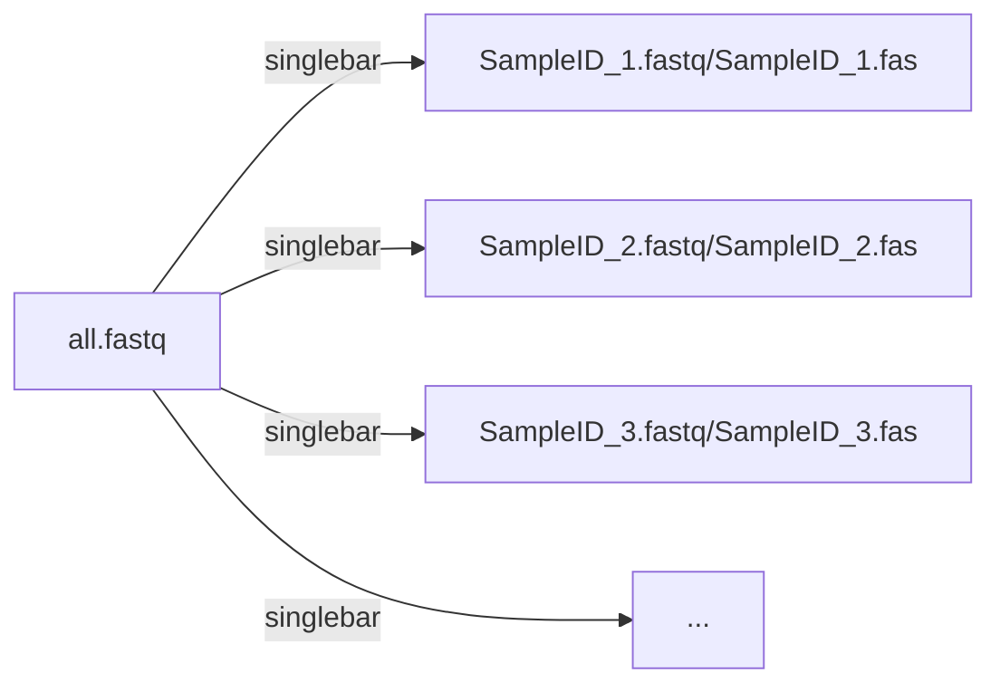
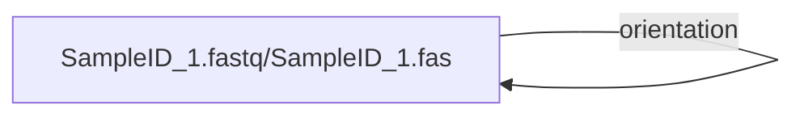

# NanoACT : a nanopore pipeline for amplicon clustering and taxonomy assignment

## Installation (Google Colab)

    !git clone https://github.com/Raingel/nanoACT.git 
    %cd nanoACT 
    !pip install --upgrade pip 
    !pip install -r requirements.txt

## Initialization

    from nanoact import nanoact
    dumb = nanoact.NanoAct()

## Usage
[combine_fastq()](#combine_fastq) 合併所有fastq檔案

[nanofilt()](#nanofilt) 以長度、品質自fastq檔案中篩選raw reads

[qualityfilt()](#qualityfilt) 以長度、品質自fastq檔案中篩選raw reads

[singlebar()](#singlebar) 根據raw reads的起始端的barcode index進行序列解訊(demultiplex)

[orientation()](#orientation) 根據提供的FwPrimer/RvPrimer (或其他表格內的欄位)來將raw reads轉成同一個方向

[trim_reads()](#trim_reads) 將raw reads頭尾截除

---
### combine_fastq
**解壓縮及合併所有fastq.gz檔案。**

 大部分basecalling軟體會產生許多fastq.gz檔案，本功能可以將所有fastq.gz檔案合併成一個fastq檔案。 

	all_fastq = dumb.combine_fastq(
					src = "./bonito", 
					des = "./des/", 
					name = "all.fastq" 
				)

    
---
### nanofilt
### qualityfilt
**根據品質篩選序列**

把混在raw reads中的低品質的雜訊移除。

nanofilt的程式碼是來自 https://github.com/wdecoster/nanofilt

qualityfilt的是由本專案設計，其單純利用每序列的平均品質分數、長度進行篩選

 
	
	all_fastq = dumb.nanofilt(src = '/content/all.fastq',
                           des = '/content/drive/MyDrive/Data/2023-000006/1_nanoflit/',
                           name = 'all_nanofilt.fastq',
                           NANOFILT_QSCORE = 9,  #recommended 7-9 
                           NANOFILT_MIN_LEN = 400, #depends on the length of your reads 
                           NANOFILT_MAX_LEN = 7000 #depends on the length of your reads
                           )
			   
	fastq_nano = dumb.qualityfilt(src = '/content/all.fastq',
                           des = '/content/drive/MyDrive/Data/2023-000006/1_nanoflit/',
                           name = 'all_qualityfilt.fastq',
                           QSCORE = 9,  #recommended 7-9
                           MIN_LEN = 400, #depends on the length of your reads 
                           MAX_LEN = 7000 #depends on the length of your reads
			   )

---
### singlebar
**根據barcode index將raw reads中混合的樣本解訊出來(demultiplex)**

 
	
	demultiplex = dumb.singlebar(
 				      #src: 輸入檔案，通常是經過qualityfilt處理的raw reads
		 		    src = '/content/all.fastq',  
	 			      #des: 一個資料夾，程式會在該資料夾中輸出以SampleID為檔名的fastq檔案或是fasta檔案（由output_format決定），例如 SampleID.fastq
				      #輸出的序列中，與barcode index吻合的位置會以小寫標記。後續可使用trim_reads()功能將barcode index等人造序列截除。
		                    des = '/content/drive/MyDrive/Data/2023-000006/2_singlebar/',  
		        	      #BARCODE_INDEX_FILE: barcode資料表，可以是csv或是tsv檔案，例如 barcode.csv。必須包含SampleID, FwIndex, RvAnchor，ExpectedLength四個欄位。
		                    BARCODE_INDEX_FILE="/content/drive/MyDrive/Data/2023-000006/230428.csv", 
		      		      #mismatch_ratio_f: FwIndex容許的錯誤率，預設為0.15。例如barcode長度為20bp，則容許0.15*20=3bp的錯誤(edit distance)。:
				    mismatch_ratio_f = 0.15, 
				      #mismatch_ratio_r: RvAnchor容許的錯誤率，預設為0.15。
				    mismatch_ratio_r = 0.15, 
			              #expected_length_variation: 預期的read長度變異，預設為0.3。例如預期的read長度為300bp，則容許0.3*300=90bp的變異。
		                    expected_length_variation = 0.3, 
		                      #search_range: 搜尋barcode的範圍，預設為150bp。代表搜尋範圍為前150bp和後150bp。
		                    search_range=150,
		                      #input_format: 輸入檔案的格式，預設為fastq。可以是fasta或fastq
		                    input_format = "fastq",
		                      #output_format: 輸出檔案的格式，預設為both。可以是fastq或是fasta。both代表同時輸出fastq和fasta。
		                    output_format = "both",
                    )

 

---
### orientation
**將raw reads轉至同一個方向**

 
	#取出raw reads的前search_range長度的序列。並將其分別與FwPrimer及RvPrimer做align。若與FwPrimer較相近則代表此read為正股，反之則為反股
	orientation = dumb.orientation(
 				      #src: 輸入檔案，通常是經過qualityfilt處理的raw reads
		 		    src='/content/drive/MyDrive/Data/2023-000003/2_Singlebar_dumb/',  
	 			      #des: 一個資料夾，程式會在該資料夾中輸出以SampleID為檔名的fastq檔案或是fasta檔案（由output_format決定），例如 SampleID.fastq
		                    des='/content/drive/MyDrive/Data/2023-000003/3_Orientation_dumb/',  
		        	      #BARCODE_INDEX_FILE: barcode資料表，可以是csv或是tsv檔案，例如 barcode.csv
		                    BARCODE_INDEX_FILE="/content/drive/MyDrive/Data/2023-000006/230428.csv",
		                      #FwPrimer: 正股序列的欄位名稱，預設為"FwPrimer"
		                    FwPrimer = "FwPrimer",
		      		      #RvPrimer: 反股序列的欄位名稱，預設為"RvPrimer"
		                    RvPrimer = "RvPrimer",
		      		      #search_range: 搜尋FwPrimer/RvPrimer的範圍，預設為200bp。代表搜尋範圍前200bp。
		                    search_range=150,
		                      #input_format: 輸入檔案的格式，預設為fastq。可以是fasta或fastq
		                    input_format = "fastq",
		                      #output_format: 輸出檔案的格式，預設為both。可以是fastq或是fasta。both代表同時輸出fastq和fasta。
		                    output_format = "both",
                    )

 

---
### trim_reads
**將raw reads的頭尾截除**

 

	dumb.trim_reads (
			  #src: 輸入檔案的資料夾位置
			src="/content/drive/MyDrive/Data/2023-000010/3_Orientation_dumb/",
			  #des: 輸出檔案的資料夾位置
			des="/content/drive/MyDrive/Data/2023-000010/4_trimmed/",
			
			  #mode為table或是case。case代表利用singlebar的小寫標記來移除頭尾序列；table則代表利用提供的表格中的資訊移除
			mode="table",
			
			  ##當mode為table時才會用到的參數
			  #Barcode表單的位置
			BARCODE_INDEX_FILE="/content/drive/MyDrive/Data/2023-000010/barcode_230615.csv",
			  #要截除的前端標記點
			fw_col = "FwIndex",
			  #要截除的後端標記點
			rv_col = "RvAnchor",
			  #前標記點的容錯率。例如FwIndex長度為20bp，則容許0.15*20=3bp的錯誤(edit distance)。:
			mismatch_ratio_f = 0.15,
			  #後標記點的容錯率
			mismatch_ratio_r = 0.15,
			  #當無法找到標記點時，是否要捨棄該read
			discard_no_match = False,
			  #是否要檢查正反兩股
			check_both_directions = True,
			  #rv_col的標記點序列是否需要先做reverse complement再比對
			reverse_complement_rv_col = True, # false if you have reverse complement your rv_col
			
			  ##共通的參數
			  #input_format: 輸入檔案的格式，預設為fastq。可以是fasta或fastq
			input_format="fastq",
			  #output_format: 輸出檔案的格式，預設為both。可以是fastq或是fasta。both代表同時輸出fastq和fasta。
			output_format="both", 
			  #從距離標記點多遠的位置開始截除。例如標記點為atg時，則對於序列AAAAatgCCCC，若fw_offset為0，則獲得之序列為CCCC；若若fw_offset為2，則獲得的序列為CC
			fw_offset = 0,
			rv_offset = 0,

	                )

 

