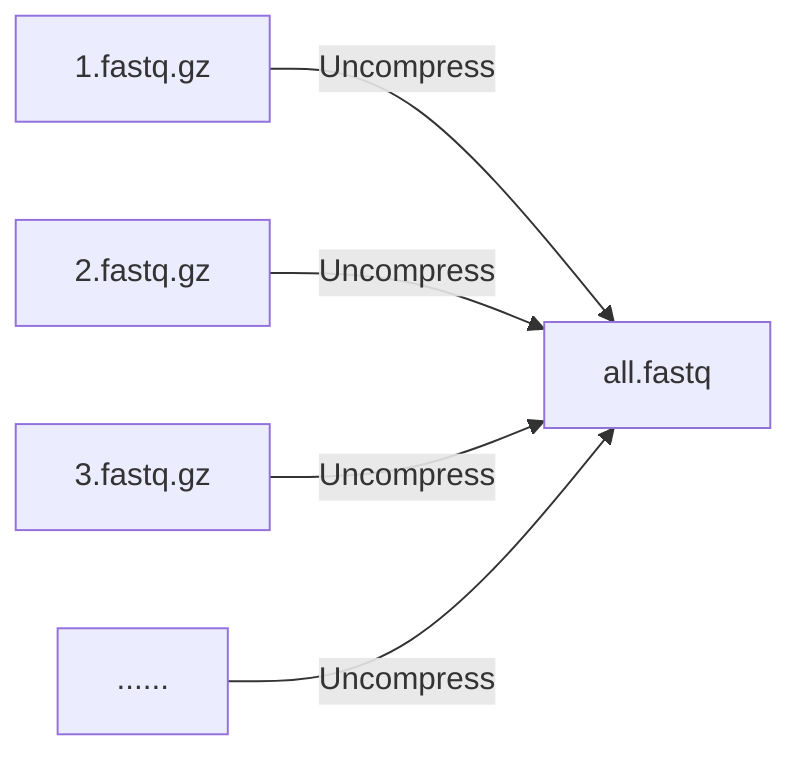

# NanoACT : a nanopore pipeline for amplicon clustering and taxonomy assignment

## Installation (Google Colab)

    !git clone https://github.com/Raingel/nanoACT.git 
    %cd nanoACT 
    !pip install --upgrade pip 
    !pip install -r requirements.txt

## Initialization

    from nanoact import nanoact
    dumb = nanoact.NanoAct()

## Usage

**解壓縮及合併所有fastq.gz檔案。**
 大部分basecalling軟體會產生許多fastq.gz檔案，本功能為將所有fastq.gz檔案合併成一個fastq檔案

 
	all_fastq = dumb.combine_fastq(
					src = "./bonito", 
					des = "./des/", 
					name = "all.fastq" 
				)
    

